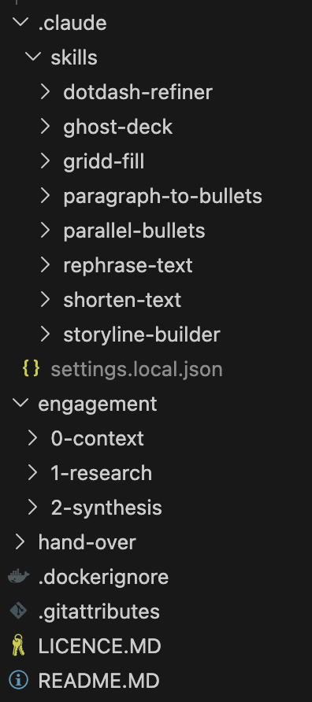

# Next-Gen Consultant

This is the new age for consultants. One without PPTX and the decades of obsolete baggage the industry carries over every day.

This project aims to bring a new type of deliverables for consultant clients with as little effort as possible required from the consultant. 

With the text based project content (`engagement` folder's markdown and json files), the work becomes more efficient and effective utilizing AI-agents and hand-made editing without the fuss of styling, pixel-perfect designing and other time sinks using the legacy PowerPoint and UI based toolkit.

Check out the live deployment on our [Demo Site](https://demo.griddapp.com)!

## How to use this project?

Fork this repository and push it to your own version control of choice.

https://github.com/GriddApp/NextGenConsultant

Work in the `engagement` folder:
- give project context, goals and aims, team info in the 0-context folder
- collect research data and backup pages in the 1-research folder
- and finalize the storyline, recommendation, insights and the supporting sources in the 2-synthesis folder

Or restructure however you wish for your own project, this content is extremely flexible for all needs!

Start docusaurus locally to see the rendered site:

```bash
cd hand-over
npm i
npm start
```

> Don't forget to commit and push often! Your new repository can act as your history and proof of how the engagement was delivered to your client!

## Claude Skills

You find beyond the /gridd-fill skill a couple of more free skills we created to make your deck making better and they can be used from Claude Code, Claude for PPT or any other Claude interface. Originally aimed at PPTX presentations, they contain significant help in any format, including in this Markdown text-based engagement!

[ ] TODO: add example prompts for each skill

## Tech stack

We chose Docusaurus as a starting point due to its versatile nature. It already processes the Markdown files extremely well and adding a few visualization plugins enable us to replace an entire management consultant project with its decks for low to now effort.

[Mermaid](https://mermaid.js.org/intro/): wide range of diagrams and charts now can be described right in your Markdown files. Use VS Code or the built site, you can add plenty of flowcharts, mindmaps, even kanban, architecture of C4 diagrams to your documents! (This project turns on as a base theme the Mermaid support officially from Docusaurus.)

[Gridd](https://www.griddtemplates.com/learn): our table editor web-component wrapped into a plugin able to process json files and when you are on local editing, you can even modify and save directly. This way, you don't have to just rely on the limited markdown tables and the text based editing!

[ReChart](https://recharts.github.io/): wrapped charting library allowing you to present any csv files as a few starting charts right into the documents! This feature to be evolved a lot, mainly to connect the styling right to the Gridd's and the CSS files.

[experimental] [D3](https://d3js.org/what-is-d3): a large scale data visualization library for the more unique presentation needs. Plenty of future improvements planned.

## Structure



## Contribution

If you like this project and want to help improve it, you can do it multiple ways:
- open issue for a fix or feature you desire but have no way to fix yourself
- open a pull-request with a problem statement and a description of the fix or feature you want to contribute with and we will review it
- open any discussion to ask for help.

Let's redefine together the future of consulting engagements! It starts with the deliverable left behind and the satisfaction and impact your client experience due to how pleasant to use the work you left behind!

## Gridd Template collection

In this repository, you find a /gridd-fill skill ready for your use with 30+ templates already making your visualization efforts faster!

We have a 200+ collection of the finest management consulting templates ready for you to use however! Check it out at https://griddtemplates.com

## Contact Us

Use https://www.griddtemplates.com/contact for any inquires related to our demo, other products.

If you would like our expertise to help set the project up for you, even consult on how to improve your team's effectiveness, reach out to us anytime!