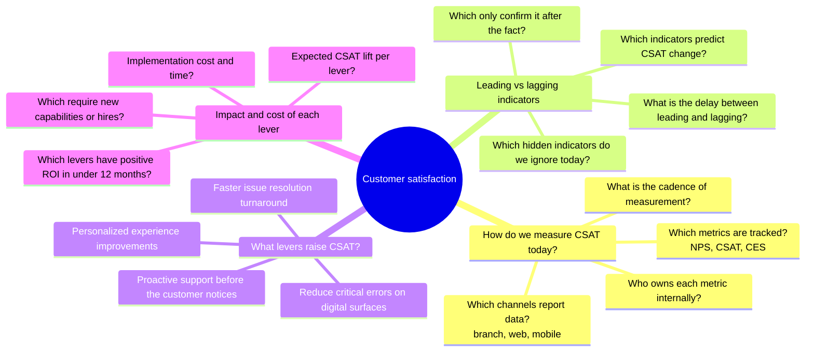

# Customer satisfaction track

How do we measure currently customer satisfaction? What are the lagging and leading indicators of it changing?

What levers can we pull to measurably increase it?

## Question map

